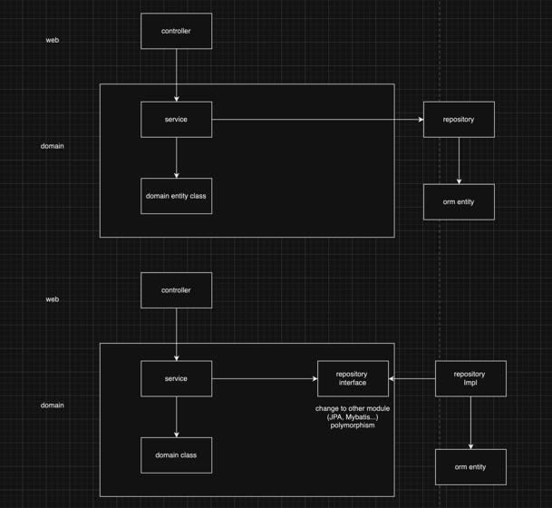
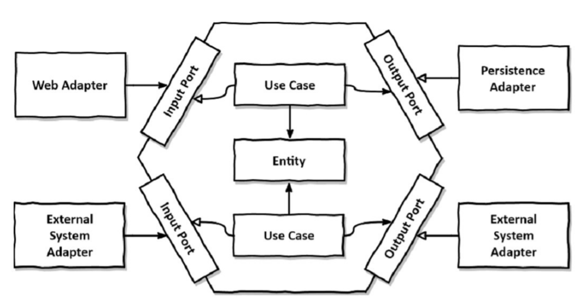
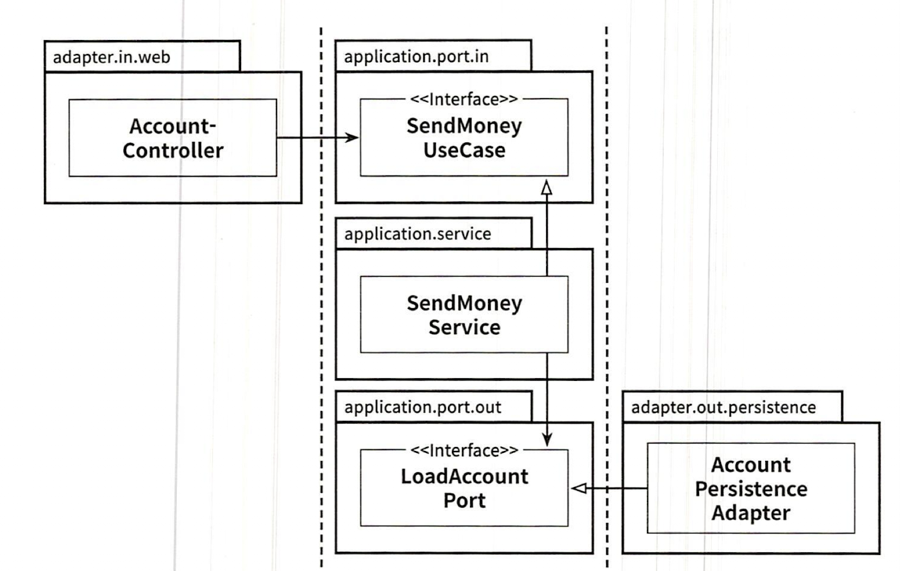

# Clean Architecture Code
## 1. DIP
- Domian 계층 의존성 을 DIP 를 사용하여  최하단으로 변경
- (SRP 즉 변경 가능성을 가장 낮은 레벨로 낮춤)
- Interface 를 통해 다형성을 활용하면서 도메인 로직은 변경하지 않는다.



## 2. Ports and adapters architecture



## 3. Hexagonal package structure
```jsx
buckpal
├── account
│   ├── adapter
│   │   ├── in
│   │   │   └── web
│   │   │       └── AccountController.java
│   │   └── out
│   │       └── persistence
│   │           ├── AccountPersistenceAdapter.java
│   │           └── SpringDataAccountRepository.java
│   ├── application
│   │   ├── SendMoneyService
│   │   ├── port
│   │   │   ├── in
│   │   │   │   ├── SendMoneyUseCase.java
│   │   │   └── out
│   │   │       ├── LoadAccountPort.java
│   │   │       └── UpdateAccountStatePort.java
│   └── domain
│       ├── Account.java
│       ├── Activity.java
```

- 핵심 요소 : 엔티티, 유스케이스, 인커밍/아웃고잉 포트, 인커밍/아웃도잉(혹은 주도하거나 주도되는) 어댑터
- account 패키지 : Account 엔티티와 관련된 유즈케이스 를 구현한 모듈
    - domain 패키지
      - 잠재적으로 어댑터,서비스에서도 접근 가능해야하는 도메인 클래스들 -> **public**
    - application 패키지 :
        - 도메인 모델을 둘러싸는 서비스 계층 
        - incoming port : 인커밍 포트 인터페이스 구현(SendMoneyUseCase)
        - outcoming port : 인터페이스이자 영속성 어댑터에 의해 구현(LoadAccountPort, UpdateAccountStatePort)
            - 어댑터에서 접근해야 하는 포트들 → **public**
            - 인커밍 포트 인터페이스 뒤에 숨길 수 있는 서비스 -> **public X**
    - adapter 패키지 : application 계층의 인커밍 포트를 호출하는 인커밍 어댑터, application 계층의 아웃고딩 포트에 대한 구현을 제공하는 아웃고잉 어댑터 포함
        - incoming 포트를 “사용”
        - outcoming 포트를 “구현”
        - **package-private**(adapter 클래스들은 application 내부에 있는 포트 인터페이스를 통해서만 바깥에서 호출가능)
          - 따라서 appication -> adapter 로 향하는 우발적 의존성은 존재할 수 없다
        - 같은 패키지에 어댑터들이 존재 하므로, 다른 구현체로 교체 하는 것도 가능하다. NoSQL 기반 영속성 어댑터 → RDBMS 기반 영속성 어댑터로 변경 가능.

- 이러한 구조는 DDD 개념에 직접 대응시킬 수 있다.
    - account 는 다른 “바운디드 컨텍스트와 통신” 할 Port 를 포함하는 Bounded context 이다.



## 4. Use Case Implementation


